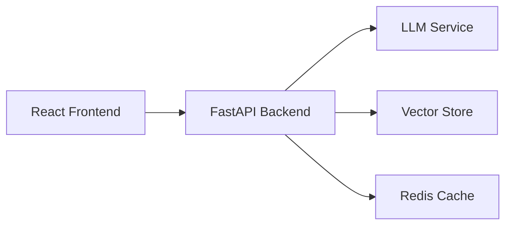

# Interactive AI Portfolio 🤖

Create your own engaging, AI-powered conversation portfolio. This open-source project enables developers to create interactive portfolios where visitors can have meaningful conversations with an AI assistant that knows about your work, experience, and expertise.

## ✨ Key Features

- 🤖 **Interactive AI Assistant**: Engage visitors with personalized, context-aware conversations
- 🚀 **Real-time Streaming**: Fluid, chat-like experience with streaming responses
- 🎨 **Modern UI**: Clean, responsive design focused on conversation
- 🔄 **Easy to Customize**: Create your own from template and modify for your personal brand
- 🛠 **Modular Architecture**: Built for maintanability and easy extension

## 🏗 Architecture

### Tech Stack

- **Frontend**: React + Vite, TailwindCSS, Framer Motion
- **Backend**: FastAPI, PostgreSQL + pgvector, Redis

## 🚀 Quick Start

1. Create a new repository from this template and clone it
2. Add the necessary files to frontend/public and change the config.json file to your own content - [Config Setup Guide](frontend/CONFIGURATION.md)
2. Run "docker compose build" and then "docker compose up" to start the containers and enjoy it on [localhost](http//:localhost:3000)
3. Deploy to [fly.io](fly.io) or set up locally- [Backend Setup Guide](backend/README.md)
4. Deploy to [vercel.com](vercel.com) or set up locally- [Frontend Setup Guide](frontend/README.md)

## 🤝 Contributing

Contributions are welcome! Please feel free to submit a Pull Request.

## 📝 License

This project is licensed under the MIT License - see the [LICENSE](LICENSE) file for details.

Made with ❤️ by Alon Trugman

